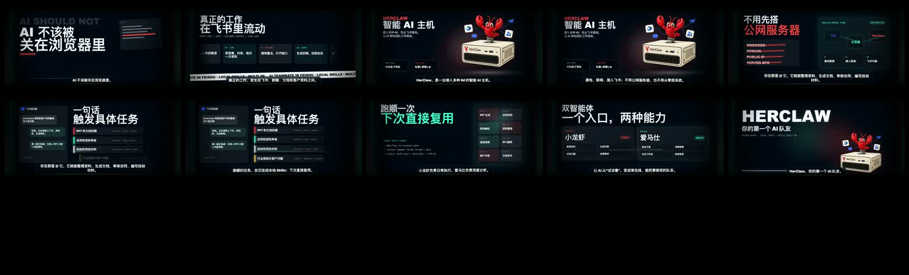

# Reference Driven Cinematic Video

一个面向 Codex 的产品视频生产 skill：把产品介绍、网站、文档、功能清单或参考视频，转成带研究补全、分镜、配音、字幕、特效路线和质量闸门的产品介绍片工作流。

它不是“把文字塞进 PPT 模板”。这个 skill 的目标是让 Codex 像一个小型视频制片流程一样工作：先理解产品和参考风格，再补全事实与视觉证据，最后选择合适的视频、3D、动效、配音、字幕和质检工具生成成片。

## 适合什么场景

- 给一段产品说明，自动补全 30-60 秒中文/英文产品介绍片。
- 给一个参考视频，复刻它的镜头语法、节奏、色彩和特效结构。
- 做科技感、曲面屏、Cyclorama、UI macro、代码流、动效字体类产品片。
- 修正“像 PPT”“AI 配音味太重”“没字幕”“画面灰尘”“节奏很散”的视频产出。
- 让 Codex 在最终交付前跑音频、字幕、黑屏、冻帧、解码和 contact sheet 检查。

## 核心流程

1. **Product Brief Expansion**
   从产品介绍、飞书文档、网站或功能清单里提取产品、用户、痛点、承诺、证据、疑虑和缺失素材。

2. **Research Sidecar**
   对薄弱产品介绍做搜索补全，生成 claim ledger、category context、visual proof board，避免写出无证据的夸张文案。

3. **Reference Audit**
   用 FFmpeg 拆参考视频：时长、分辨率、帧率、音频现实、contact sheet、关键帧和镜头语法。

4. **Style And Asset Plan**
   选择主视觉载体，例如曲面屏、产品 render、UI macro、代码流、动效字体或数据流，而不是堆叠多个幻灯片场景。

5. **Voiceover Gate**
   中文配音必须先过口播稿、样音、音量、LUFS、峰值和授权检查。用户音色必须有干净人声样本，不能从静音视频硬说成克隆。

6. **Captions Gate**
   有旁白就默认要字幕：烧录字幕进 MP4，并尽量同时输出 `.srt`。

7. **Motion Build**
   根据参考风格选择合适的程序化视频、3D 曲面屏、网页动效或向量动画实现路线。

8. **Quality Gate**
   交付前必须跑 `quality_check_video.py`，低于 80 分默认只能叫 draft。

## 曲面屏风格标准

如果参考是曲面屏、沉浸式屏幕、Cyclorama 或类似科技感展示效果，skill 会要求：

- 使用真实 bent mesh，不用 CSS 假透视。
- 默认 `PlaneGeometry(3.2, 1.8, 64, 20)`。
- 弯曲公式：`z = bend * 0.42 * nx * nx`。
- 产品场景先预合成为 16:9 texture，再贴到曲面屏上。
- 主屏占画面 65-85% 宽度。
- 走 line draw -> expand -> bend -> media broadcast -> collapse 的连续几何变形。

## 配音与字幕标准

最好的配音路线：

1. 用户提供自己的干净录音，直接用真实声音或作为授权音色样本。
2. 用户接入自己已有的配音、TTS 或 voice-clone API，由 skill 走该 API 生成音频。
3. 如果没有录音，也没有可用 API，就使用默认中文神经音色生成旁白，并明确它不是用户音色克隆。

默认音色也要先出 10-15 秒样音。听感不行就调脚本、语速、音高和混音，不把明显廉价的配音硬塞进最终片。macOS `say` 不允许作为最终成片。

中文口播规则：

- 5-10 句短口语。
- 少讲抽象价值，多讲真实工作场景。
- 避免“赋能、无缝、革命性、生态闭环、行业领先”等广告腔。
- 先出 10-15 秒样音，听起来不行就调，不把烂配音硬塞进最终片。

## 质量检查脚本

skill 自带：

- `scripts/analyze_reference_video.py`：分析参考视频，输出 probe、音量、静音、contact sheet、关键帧。
- `scripts/quality_check_video.py`：检查最终视频，输出 `quality-report.json`。
- `scripts/srt_from_segments.py`：从 JSON 字幕片段生成 SRT。

示例：

```bash
python3 reference-driven-cinematic-video/scripts/quality_check_video.py final.mp4 \
  --expect-audio \
  --expect-subtitles \
  --srt captions.srt \
  --min-score 80
```

它会检查：

- FFmpeg decode 是否通过。
- 视频/音频流是否存在。
- 音量是否在目标区间。
- SRT 是否存在。
- 是否有长黑屏、长静音、冻帧。
- 是否生成 contact sheet。
- 最终 `score` 是否达到阈值。

## 安装

克隆后把 skill 目录同步到 Codex skill 目录：

```bash
git clone https://github.com/siuserxiaowei/reference-driven-cinematic-video-skill.git
mkdir -p ~/.codex/skills
rsync -a reference-driven-cinematic-video-skill/reference-driven-cinematic-video/ \
  ~/.codex/skills/reference-driven-cinematic-video/
```

验证：

```bash
python3 ~/.codex/skills/.system/skill-creator/scripts/quick_validate.py \
  ~/.codex/skills/reference-driven-cinematic-video
```

## 使用示例

### 示例成片

下面这条 HerClaw 产品介绍片，是用这套工作流生成并做过字幕、配音、色调和质量检查的一版样片。

<video src="examples/herclaw/herclaw-product-intro-cinematic-subtitled-v2-final.mp4" controls width="100%"></video>

- 视频文件：[examples/herclaw/herclaw-product-intro-cinematic-subtitled-v2-final.mp4](examples/herclaw/herclaw-product-intro-cinematic-subtitled-v2-final.mp4)
- 抽帧检查图：



### 案例提示词

#### 1. 柔和温暖风产品介绍片

适合 ToB 服务、团队协作工具、AI 助手、知识库、内部系统等不想太冷硬的产品。

```text
用 $reference-driven-cinematic-video

这是我的产品介绍：
<产品文档链接 1>
<产品文档链接 2>

目标：30-40 秒产品介绍片，中文配音，偏柔和温暖风。

配音要求：
优先使用我提供的录音或我接入的配音 API。
如果我没有提供录音/API，就使用默认中文神经音色，并在交付说明里标注“默认音色，非克隆用户声音”。

你自己搜索补全，最后给我成片。
```

#### 2. 高级科技感产品发布片

适合 AI 硬件、开发者工具、自动化系统、数据产品、Agent 平台。

```text
用 $reference-driven-cinematic-video

这是我的产品介绍：
<产品文档、官网或功能说明>

目标：30-40 秒产品介绍片，中文配音，高级科技感。
画面希望有曲面屏、UI 宏观特写、代码流或任务流动效。

请你搜索补全产品定位和用户痛点，写口播稿、分镜、字幕，并生成最终成片。
```

#### 3. 带参考视频的风格复刻

适合已经有目标审美，希望 Codex 先拆参考片的镜头语法，再套到自己的产品上。

```text
用 $reference-driven-cinematic-video

产品介绍：
<产品说明或文档链接>

参考视频：
<本地视频路径或公开视频链接>

目标：45 秒以内，中文配音，保留参考视频的节奏、镜头语言、字幕风格和转场感觉。
不要照抄参考视频里的品牌或内容，只学习它的视觉结构。

请先分析参考视频，再生成我的产品成片。
```

#### 4. 使用自己的录音或配音 API

适合对“AI 味配音”敏感的正式宣传片。

```text
用 $reference-driven-cinematic-video

产品介绍：
<产品说明>

配音素材：
<我的 20-60 秒干净人声样本路径>

或者使用我的配音 API：
provider: <API 名称>
voice_id: <音色 ID>
style: 温暖、可信、自然，不要播音腔

目标：30-60 秒产品介绍片，中文配音，带字幕。

如果录音不可用，请直接说明原因；不要把默认音色说成我的声音。
```

#### 5. 修复已有低质量视频

适合已经生成过一版，但有 PPT 感、没字幕、配音难听、画面脏灰、节奏散等问题。

```text
用 $reference-driven-cinematic-video

已有视频：
<本地视频路径>

产品介绍：
<产品文档或说明>

问题：
- 没有字幕
- 配音太 AI
- 画面太灰或太像 PPT
- 节奏不够像正式产品片

请重新做一版，并跑质量检查后再交付。
```

## 依赖建议

基础依赖：

- Python 3
- FFmpeg / ffprobe
- Node.js

可选实现能力：

- 程序化视频渲染
- 3D 曲面屏 / 产品展示
- 网页动效转视频
- 旁白生成或外部配音 API 接入
- 字幕生成、烧录和 SRT 导出
- FFmpeg 质检与交付检查

配音能力取决于用户提供的录音或用户接入的 API。没有录音和 API 时，skill 会使用默认中文神经音色，并在交付说明里标注“默认音色，非克隆用户声音”。

## 许可证

暂未指定许可证。公开仓库可供查看与学习，但复用、分发、商用授权需要仓库所有者后续明确。
